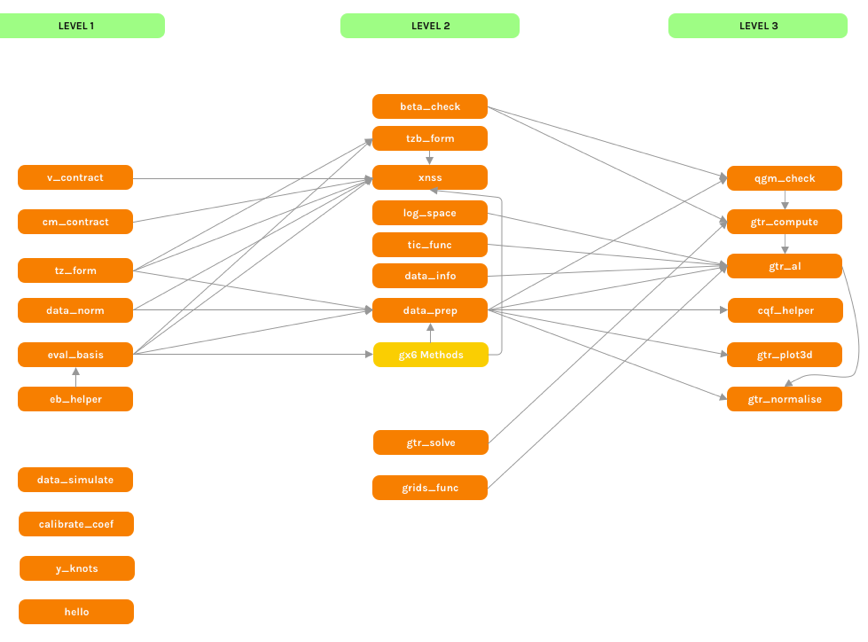

<!-- README.md is generated from README.Rmd. Please edit that file -->

# gtreg

<!-- badges: start -->
<!-- badges: end -->

This package provides the software tools to implement Gaussian Transform
Regression introduced in “Gaussian transforms modeling and the
estimation of distributional regression functions” Spady and Stouli
(2020).

With the tools in this package it is possible to obtain inference and
estimation results for conditional distribution, quantile and density
functions implied by flexible Gaussian representations.

For further details, please refer to the original text.

### Version 0.3.0

This version is a preliminary version!

-   Contains all the functions necessary to do get core results.
-   Imports necessary packages for functions.
-   Has an simple application vignette to get results.
-   Basic documentation.

## Installation

In order to install this package you need to use the Github version.
Hopefully in the future a CRAN version will be possible.

Following the steps below, you will be able to install the `gtreg` R
package from GitHub, in each of R, R Studio, and Displayr.

The process is as follows:

1.  Install and load the `devtools` package.

<!-- -->

    install.packages("devtools")
    library(devtools)

2.  Install the `gtreg` package using the Github repo location and load
    it.

<!-- -->

    install_github("diego-lda/gtreg")
    library(gtreg)

All done!

## Style

In terms of style, to avoid confusion between objects and functions the
soggested style that we will use is the underscore_separated convention.

## Function Map

The picture below shows all the functions in this package as well as how
they interact with each other. This can be useful for understanding what
functions use what as well as how the package is built.

